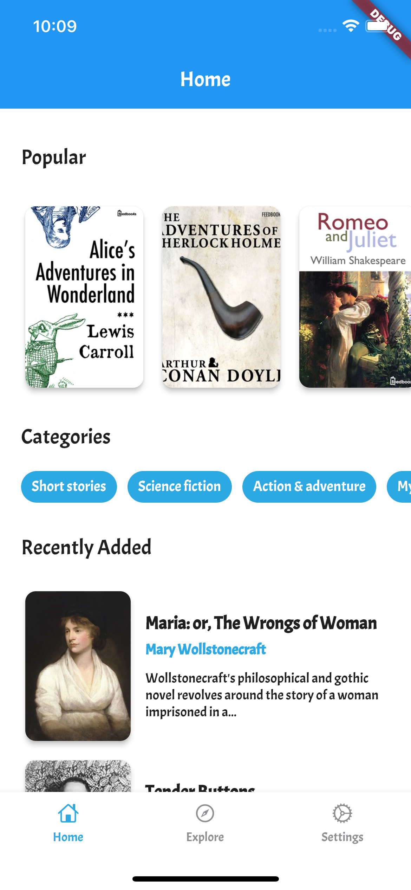
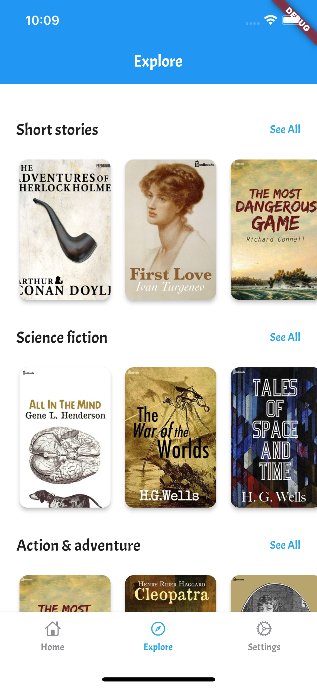
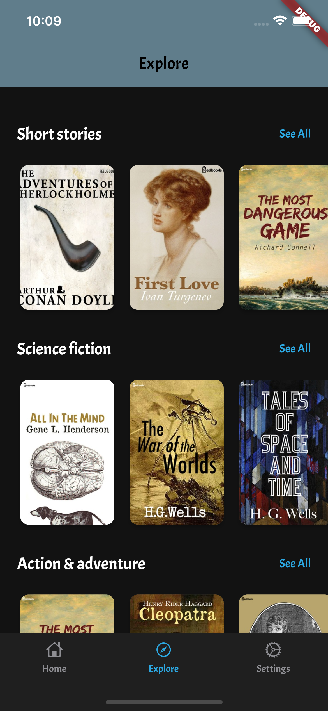
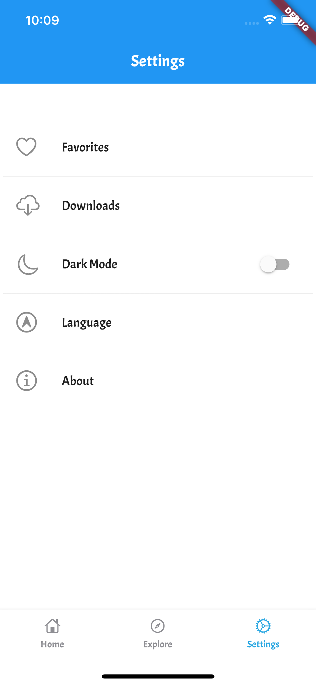
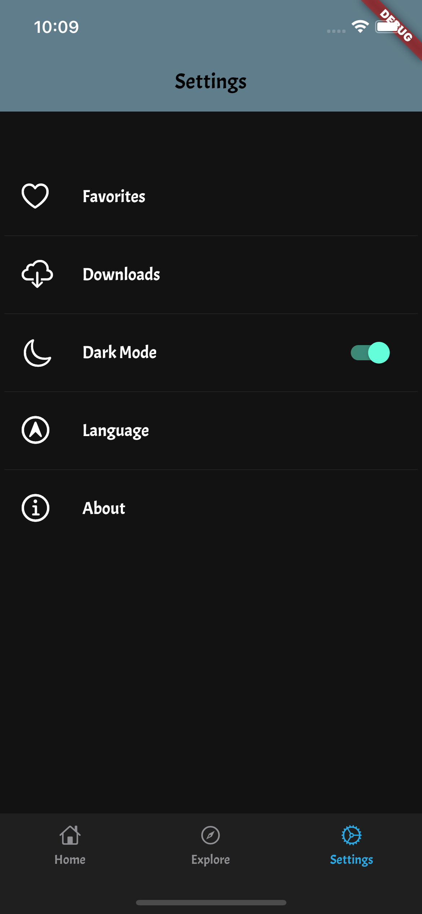
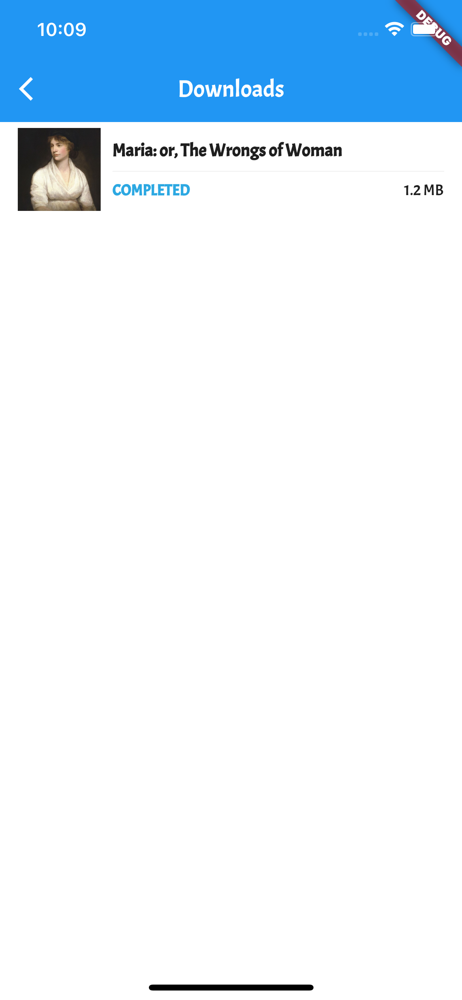
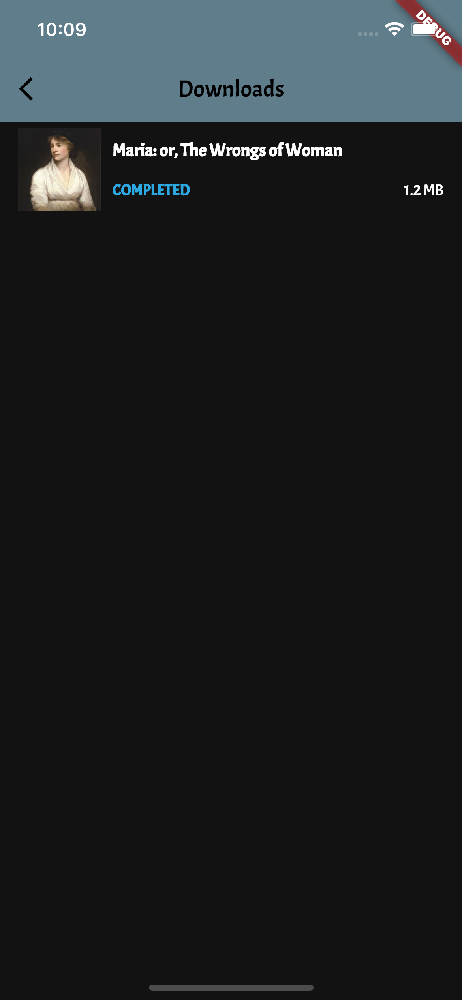

# Flutter Awesome Ebook App
Complete Flutter Application with Getx & Freezed + Retrofit for API REST.

A simple Flutter app to Read and Download books. The Books included in the app
are from the [Public Domain](https://en.wikipedia.org/wiki/Public_domain)
(Expired Copyright and completely free).

[](https://flutter.dev/docs/get-started/install)
[](https://choosealicense.com/licenses/mit/)

<a href="http://www.feedbooks.com/"></a>
<br>

To download  the apk file of this app, <a href="https://drive.google.com/file/d/11m8Xj7gr2IS6Lp9RIrQ18CFMZGd4RzNd/view?usp=sharing">click here</a>


## Features 
- API REST (Feedbooks)
- Read eBooks.
- Favorites.
- Light / Dark Theme.
- Downloads.
- Categories.

### Stack
- Flutter 2.12.0 (Null Safety)
- Getx
- Freezed
- Retrofit
- Floor


## Screenshots


| Light | Dark |
|  --- |  ---    |
||
||
||
||
||
 
## Setup project

Download project
```bash
git clone https://github.com/aliayn/EbookApp.git
```

Get flutter dependencies
```bash
flutter pub get
```

Run the app
```bash
flutter run
```


## Resources
[Flutter Docs](https://flutter.dev/docs)

[Getx Docs](https://pub.dev/packages/get)

[Retrofit Docs](https://pub.dev/packages/retrofit)

[Floor Docs](https://pub.dev/packages/floor)


## Licence

```
MIT License

Copyright (c) 2021 Salvador Valverde

Permission is hereby granted, free of charge, to any person obtaining a copy
of this software and associated documentation files (the "Software"), to deal
in the Software without restriction, including without limitation the rights
to use, copy, modify, merge, publish, distribute, sublicense, and/or sell
copies of the Software, and to permit persons to whom the Software is
furnished to do so, subject to the following conditions:

The above copyright notice and this permission notice shall be included in all
copies or substantial portions of the Software.

THE SOFTWARE IS PROVIDED "AS IS", WITHOUT WARRANTY OF ANY KIND, EXPRESS OR
IMPLIED, INCLUDING BUT NOT LIMITED TO THE WARRANTIES OF MERCHANTABILITY,
FITNESS FOR A PARTICULAR PURPOSE AND NONINFRINGEMENT. IN NO EVENT SHALL THE
AUTHORS OR COPYRIGHT HOLDERS BE LIABLE FOR ANY CLAIM, DAMAGES OR OTHER
LIABILITY, WHETHER IN AN ACTION OF CONTRACT, TORT OR OTHERWISE, ARISING FROM,
OUT OF OR IN CONNECTION WITH THE SOFTWARE OR THE USE OR OTHER DEALINGS IN THE
SOFTWARE.
```

